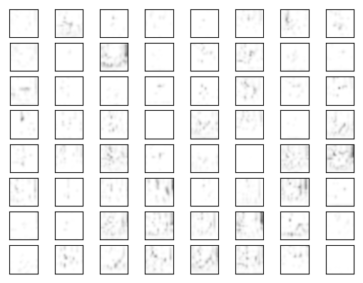
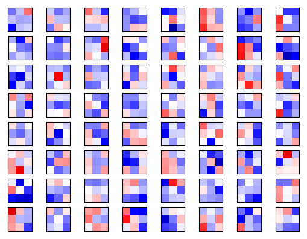

# Build own model using tensorflow api and filters and layers visualization

Let's say, the structure of the model is:

| Input (32 x 32 RGB images) | Layers|
|:----------:|:-------:|
| Conv3-8 | Layer-1 |
| Conv3-8 | Layer-2 |
| Conv3-8 | Layer-3 |
| maxpool | Layer-4 |
| Conv3-64 | Layer-5 |
| Conv3-64 | Layer-6 |
| Conv3-64 | Layer-7 |
| maxpool | Layer-8 |
| Conv3-64 | Layer-9 |
| Conv3-64 | Layer-10 |
| Conv3-64 | Layer-11 |
| maxpool | Layer-12 |
| FC-1024 | Layer-13 |
| FC-10 | Layer-14 |
| softmax | Layer-15 |

* Conv3-8 means the convolutional kernel is 3 × 3, and number of output channels is 8, the padding style is **SAME** rather than **VALID** (see `tf.nn.conv2d`)
* FC-1024 means the output size of the FC layer is 1024
* stride of Conv layers is 1, stride of pooling layers is 2
* kernel size of maxpool is 2 x 2

## Dirs used
Here, we spicify the following paths for the model for convenience. Please change them to your own path when doing yourself.<br>
**Path where you download cifar10 dataset:** */mymodel/cifar10-data*<br>
**Path where you save your model to when training and load your model from when testing or finetuning:** */mymodel/model*<br>
**Path where visualization results are saved:** */mymodel/visual_results*<br>

# Preparation 
Refer to codes in assignment4 for training and using tensorboard

## visualization 
Refer to `model_visualize.py` or [the original github repository](https://github.com/grishasergei/conviz)<br>
Run example:
First, add your code at the end of `model_visualize.py`<br>
```bash
python model_visualize.py \
  --train_dir='/mymodel/model' \
  --data_dir='/mymodel/cifar10_data' \
  --visual_dir='/mymodel/visual_results'
```
The results of visualization are like this<br>
**con_weights_layer5_channel_0** (show only image of the first channel)<br>


**conv_output_layer5**<br>


**con_weights_layer11_channel_33** (image of channel 34)<br>


**conv_output_layer11**<br>


Any problem: email zhuo.su@oulu.fi
